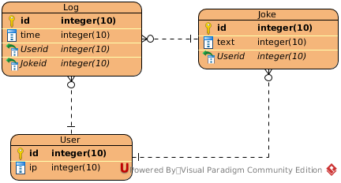
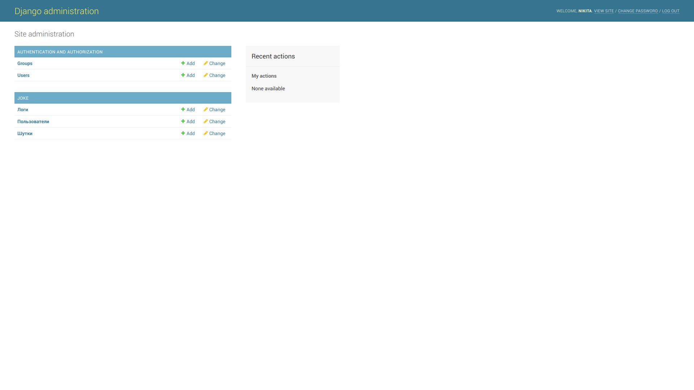

# API Jokes

### Задачи проекта

Написать простой многопользовательский REST-сервис с тремя эндпоинтами

**Сервис должен иметь эндпоинты:**

  - Сгенерировать шутку.
  - Получить шутку.
  - Посмотреть список “моих” шуток.
  - Обновить текст шутки (только своей).
  - Удалить шутку
  
> Сервис должен сохранять историю с данными: идентификатор пользователя, IP адрес 
и время обращения из запроса, которые к нему приходят. В качестве генератора шуток 
нужно использовать API geek-jokes (https://geek-jokes.sameerkumar.website/api). 
При получении шутки нужно проверять её уникальность и сохранять в локальной базе 
данных только уникальные шутки.

### База данных



Сущности приложения:

* **User** - хранит инфомацию о уже авторизованных пользователях в системе
* **Joke** - данные о полученных шутках через внешнее api
* **Log** - формат хранения логов всех запросов пользователя

В качестве СУБД для проекта была выбрана PostgreSQL

### Авторизация пользователей

Авторизация на сервере происходит через внутреннее middleware. 
Оно получает ip адрес места, с которого был выполнен запрос и ищет этого пользователя в базе данных.

- Если пользователь есть, то объект пользователя передается далее в запросе, в переменной api_user
- Если пользователь не найден в базе, то он создается и передается далее в контексте запроса

### Swagger

В качестве документации к REST api был выбран инструмент swagger позволяющий работать
с документацией в интерактивном формате

Swagger запускается на эндпоинте `/doc/`


### Настройка окружениия

Сначала необхоисо активировать виртуальное окружение и скачать все необходимые пакеты:

```sh
$ pip install -v virtualenv && virtualenv --no-site-packages ./venv
$ ./venv/bin/activate 
$ pip install -v -r requirements.txt
```

Данное приложение запускается на внутреннем сервере Gunicorn, который будет установлен вместе со всеми пакетами

* Предварительно необходимо создать базу данных для приложения

Далее необходимо запустить миграции базы данных и создать суперпользователя всей системы:

```sh
$ python manage.py migrate
$ python manage.py createsuperuser
```

Запуск приложения (По умолчанию запуск происходит на 8000 порту)

```sh
$ python manage.py runserver
```


#### Тестирование
Тестирование осуществляется внутренним фреймворком Django. Оно носит модульный характер и проверяет работу эндпоинтов

Запуск всех тестов осуществляется через команду `python manage.py test`:
```sh
$ python manage.py test
Creating test database for alias 'default'...
System check identified no issues (0 silenced).
...........
----------------------------------------------------------------------
Ran 11 tests in 2.092s

OK
Destroying test database for alias 'default'...

```

### Администрирование
Управление данными возожно непосредственно из приложения. Для этого необходимо перейти по эндпоинту `admin/`:

